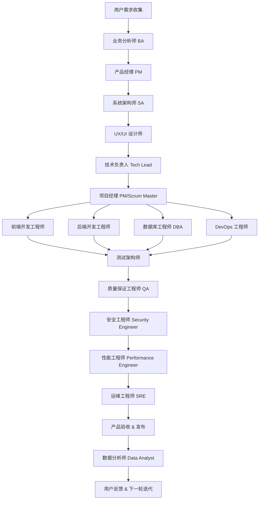
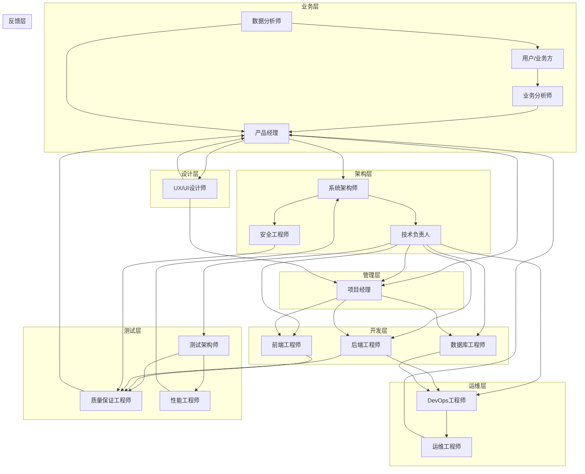

# 使用中文和我交互
# agent.md — AgentOS v0.1 一页蓝图与落地清单

> 版本：v0.1（汇总现有资料 → 一页蓝图 + 落地清单）
> 目标：面向真实需求，构建能「感知—思考—行动」并自迭代的 AgentOS（质量 > 成本 > 延迟，可配置）。
> 原则：离线优先、预算有上限、度量驱动；不自训基座模型，适配多家 LLM。

## -1. 高信息密度指令词行动手册（压缩版）

**定位**：用于所有跨角色协作场景，确保“开口即定位、落地可执行”，减少往返沟通与返工。

### 核心工作公式
- 任务 = **指令词 + 对象 + 截止时间 + 验收口径**，需指定责任人和时区。

### 四条铁律
1. **证据优先**：结论必须附日志/数据/链接。
2. **最小可用**：先产出可演示版本，再逐步打磨。
3. **时间盒**：探索与排查必须给定硬时限，超时立刻升级或切换方案。
4. **单点闭环**：一个任务只设一位 Owner，对结果全责到底。

### 三步导入
1. 结合业务挑选 10 个最高频指令词，沉淀成 v1。
2. 为每个词制作“卡片”（定义/场景/模板/反例），贴到 Issue 模板与会议纪要。
3. 在任务、周会、上线单中强制带入“指令词+截止+验收”，持续每两周复盘采纳率与返工率。

### 推荐指令词 Top10（适配 AgentOS 交付）
| 指令词 | 聚焦价值 | 推荐指令模板 |
| --- | --- | --- |
| 顺藤摸瓜 | 复杂缺陷快速锁因 | 顺藤摸瓜到〔最小可复现步骤〕，〔时间〕前给我时间线+证据。 |
| 最小复现 | 构建可重放的 Bug 现场 | 产出最小复现脚本，附输入/输出/期望对照。 |
| 时间盒 | 控制探索/排查成本 | 时间盒〔时长〕，到点切 B 案或升级。 |
| 冒烟先行 | 合并/上线前的底线检查 | 冒烟过清单再进灰度，附截图或日志。 |
| DoD 对齐 | 避免“完成”认知差异 | DoD 写进任务：脚本/日志/截图/验收人。 |
| 单点闭环 | 明确责任归属 | 单点闭环由〔负责人〕负责，他人仅供输入。 |
| 黄金路径 | 优先保障主流程体验 | 优先把黄金路径拉满，次要路径排后。 |
| 预案三件套 | 上线风险防控 | 提交回滚/监控/兜底三件套与触发条件。 |
| 回归红线 | 防止历史问题复发 | 把故障样本纳入红线集，合并前必跑。 |
| 知识回填 | 沉淀可复用资产 | 回填 SOP+脚本+告警规则到知识库。 |

### 流程嵌入模板
1. **任务下发**：〔指令词+对象〕—〔期望结果〕；正文需写目标/边界/依赖/风险/验收，记录 Owner 与拍板人。
2. **故障排查**：先止血→抓主矛盾→二分定位，5 分钟同步一次红/黄/绿与所需支持。
3. **版本上线**：必备预案三件套、金丝雀策略、熔断阈值，附监控与回滚步骤。
4. **周度复盘**：本周目标/达成/偏差/纠偏，下周黄金路径与临界路径风险，沉淀可教时刻与知识回填。

### 红线与度量
- **反模式**：无验收口径、无证据、无限调参、多人共担、灰度无指标、复盘甩锅、信息只在私聊。
- **核心指标**：指令词采用率≥80%、Lead Time、返工率、MTTR、首个纵切 Demo 用时。
- **退出条件**：两周内无显著提升需回顾词表或流程，防止沉没成本。

### 工具化建议
- 在 CI/机器人内校验“指令词/截止/验收/Owner/拍板人”是否齐全。
- 看板新增字段：指令词、Owner、状态（红黄绿）、验收链接、退出条件。
- 演示录屏、日志、对比实验、决策日志须统一归档，便于复盘与新成员接手。

---

## 0.0 敏捷开发角色流程（用户需求 → 产品迭代）

### 0.0.1 完整角色链与职责
每个需求都按以下完整的资深角色流程进行敏捷开发迭代：



### 0.0.2 各角色详细职责

**1. 用户需求收集阶段**
- 用户画像调研、使用场景分析、痛点识别
- 市场竞品分析、用户访谈、需求收集
- 业务目标确认、成功指标定义
- 约束条件分析（时间、预算、技术、合规）

**2. 业务分析师 (Business Analyst)**
- 业务流程梳理和优化建议
- 需求可行性分析和影响评估
- 业务规则定义和异常场景处理
- 与各利益相关方的需求确认和冲突解决
- 业务价值评估和ROI分析

**3. 产品经理 (Product Manager)**
- PRD（产品需求文档）撰写和维护
- 产品路线图规划和功能优先级排序
- 市场定位和竞争策略制定
- 产品生命周期管理
- 跨部门协调和资源分配

**4. 系统架构师 (System Architect)**
- 系统整体架构设计和技术选型
- 非功能性需求分析（性能、安全、可扩展性）
- 技术债务评估和重构建议
- 架构治理和技术标准制定
- 技术风险识别和缓解策略

**5. UX/UI 设计师 (UX/UI Designer)**
- 用户体验研究和信息架构设计
- 交互原型设计和可用性测试
- 视觉设计和品牌一致性保证
- 设计系统和组件库维护
- 响应式设计和多端适配

**6. 技术负责人 (Tech Lead)**
- 技术方案设计和代码架构规划
- 团队技术能力提升和知识分享
- 代码质量把控和最佳实践推广
- 技术债务管理和重构计划
- 跨团队技术协作和标准统一

**7. 项目经理 (Project Manager/Scrum Master)**
- 项目计划制定和里程碑管理
- 资源协调和进度跟踪
- 风险识别、评估和应对措施
- 团队协作促进和冲突解决
- 敏捷流程优化和度量分析

**8. 前端开发工程师 (Frontend Developer)**
- 用户界面开发和交互实现
- 前端性能优化和兼容性处理
- 组件化开发和代码复用
- 前端测试和调试
- 用户体验优化和无障碍访问

**9. 后端开发工程师 (Backend Developer)**
- 服务端逻辑开发和API设计
- 数据库设计和查询优化
- 业务规则实现和异常处理
- 服务性能优化和安全防护
- 第三方系统集成和接口对接

**10. 数据库工程师 (Database Administrator)**
- 数据库架构设计和性能调优
- 数据安全和备份恢复策略
- 数据迁移和同步方案
- 数据质量监控和治理
- 数据库容量规划和扩展

**11. DevOps 工程师**
- CI/CD流水线设计和自动化部署
- 基础设施即代码和环境管理
- 容器化和微服务治理
- 监控告警和日志分析
- 故障应急响应和容量规划

**12. 测试架构师 (Test Architect)**
- 测试策略制定和测试框架设计
- 自动化测试平台建设
- 测试环境规划和数据管理
- 测试工具选型和集成
- 测试度量和质量分析

**13. 质量保证工程师 (QA Engineer)**
- 测试计划制定和用例设计
- 功能测试、集成测试、回归测试
- 缺陷跟踪和测试报告
- 用户验收测试协助
- 质量标准制定和执行

**14. 安全工程师 (Security Engineer)**
- 安全威胁建模和风险评估
- 安全测试和漏洞扫描
- 安全编码规范和培训
- 安全事件响应和处理
- 合规性检查和审计

**15. 性能工程师 (Performance Engineer)**
- 性能测试计划和场景设计
- 性能瓶颈分析和优化建议
- 容量规划和压力测试
- 性能监控和基线建立
- 性能调优和最佳实践

**16. 运维工程师 (SRE - Site Reliability Engineer)**
- 生产环境稳定性保障
- 服务可用性监控和告警
- 故障排查和根因分析
- 灾备方案和演练
- 运维自动化和效率提升

**17. 数据分析师 (Data Analyst)**
- 产品数据埋点和指标体系
- 用户行为分析和洞察
- A/B测试设计和效果评估
- 业务报表和仪表盘
- 数据驱动的产品优化建议

### 0.0.3 完整项目开发流程

**阶段一：需求分析与规划 (3-5天)**
```yaml
Day 1: 需求收集与业务分析
  - 用户调研和需求确认 (用户/BA)
  - 业务价值评估和ROI分析 (BA/PM)
  - 竞品分析和市场调研 (PM)

Day 2-3: 产品设计与架构设计
  - 产品需求文档(PRD)撰写 (PM)
  - 系统架构设计和技术选型 (SA)
  - 用户体验设计和原型制作 (UX/UI)

Day 4-5: 项目规划与资源分配
  - 项目计划制定和里程碑设定 (项目经理)
  - 技术方案设计和工作量评估 (Tech Lead)
  - 团队组建和角色分工 (项目经理)
```

**阶段二：Sprint 开发迭代 (2周周期)**
```yaml
Sprint 规划会 (Day 0):
  - Sprint目标确定和任务分解
  - 用户故事估点和优先级排序
  - 技术债务和风险评估
  - 测试策略和验收标准确认

Week 1 - 开发阶段:
  Day 1-2: 详细设计与开发准备
    - 技术方案细化和接口设计 (Tech Lead/开发)
    - 数据库设计和性能优化方案 (DBA)
    - 前端组件设计和API设计 (前端/后端)
    - 测试计划制定和环境准备 (测试架构师/QA)

  Day 3-5: 核心功能开发
    - 前端界面开发和交互实现 (前端)
    - 后端业务逻辑和API开发 (后端)
    - 数据库建模和优化实现 (DBA)
    - 单元测试和代码质量检查 (开发/QA)

  Weekend: Code Review和持续集成
    - 代码审查和最佳实践检查 (Tech Lead)
    - CI/CD流水线更新和自动化测试 (DevOps)

Week 2 - 测试与部署阶段:
  Day 1-2: 集成测试与性能测试
    - 功能集成测试和接口测试 (QA)
    - 性能测试和压力测试 (性能工程师)
    - 安全测试和漏洞扫描 (安全工程师)
    - 监控和日志系统配置 (DevOps/SRE)

  Day 3-4: 系统测试与缺陷修复
    - 端到端测试和用户场景验证 (QA)
    - 缺陷修复和回归测试 (开发/QA)
    - 性能调优和系统优化 (性能工程师/SRE)
    - 部署脚本和环境配置 (DevOps)

  Day 5: 发布部署与验收
    - 生产环境部署和灰度发布 (DevOps/SRE)
    - 用户验收测试和业务验证 (PM/业务方)
    - 监控指标验证和告警配置 (SRE)
    - 数据分析和效果评估 (数据分析师)

Sprint 回顾会:
  - 交付成果演示和反馈收集
  - 团队协作和流程优化讨论
  - 技术债务和改进计划制定
  - 下一轮Sprint规划准备
```

**每日协作流程**
```yaml
每日站会 (Daily Standup):
  时间: 9:00-9:15 (15分钟)
  参与者: 开发团队全员
  内容:
    - 昨天完成了什么？
    - 今天计划做什么？
    - 遇到什么阻碍？
    - 需要什么帮助？

技术同步会 (Tech Sync):
  时间: 周二/周四 15:00-15:30
  参与者: Tech Lead、架构师、高级开发
  内容:
    - 技术方案讨论和决策
    - 架构演进和重构计划
    - 代码质量和最佳实践

设计评审会 (Design Review):
  时间: 周三 14:00-15:00
  参与者: UX/UI、PM、Tech Lead、前端
  内容:
    - 设计方案评审和反馈
    - 技术可行性确认
    - 用户体验优化建议
```

**完整 DoD (Definition of Done) 标准**
```yaml
功能开发完成度:
  - [ ] 需求实现完整，符合验收标准
  - [ ] Code Review通过，代码质量达标
  - [ ] 单元测试覆盖率 ≥ 80%
  - [ ] 集成测试和E2E测试通过
  - [ ] 性能指标达到预设基线
  - [ ] 安全扫描无高危漏洞

质量保证标准:
  - [ ] 功能测试用例执行通过
  - [ ] 回归测试无新增缺陷
  - [ ] 用户验收测试通过
  - [ ] 兼容性测试通过
  - [ ] 无障碍访问测试通过

运维部署标准:
  - [ ] 部署脚本和配置完成
  - [ ] 监控指标和告警配置
  - [ ] 日志系统集成完成
  - [ ] 备份和恢复方案验证
  - [ ] 灰度发布策略执行

文档和知识管理:
  - [ ] 技术文档和API文档更新
  - [ ] 用户手册和操作指南
  - [ ] 知识库和FAQ更新
  - [ ] 代码注释和架构说明

合规和安全要求:
  - [ ] 数据隐私保护合规检查
  - [ ] 安全编码规范遵循
  - [ ] 访问控制和权限验证
  - [ ] 审计日志和合规记录
```

### 0.0.4 角色协作原则与交互关系

**详细角色交互矩阵**


**沟通机制和会议节奏**

**常规会议**
- 每日站会 (Daily Standup): 9:00-9:15，全开发团队参与
- 技术同步会 (Tech Sync): 周二/周四 15:00-15:30，技术团队参与
- 设计评审会 (Design Review): 周三 14:00-15:00，设计和产品团队参与
- 产品评审会 (Product Review): 周五 16:00-17:00，产品和业务团队参与

**阶段性会议**
- Sprint规划会 (Sprint Planning): 每两周一次，2小时
- Sprint回顾会 (Sprint Retrospective): 每两周一次，1小时
- 架构评审会 (Architecture Review): 每月一次，2小时
- 安全评审会 (Security Review): 根据需要，每个重要功能发布前

**决策机制和权责分工**

**产品决策**
- 责任方：产品经理 (PM)
- 输入方：业务分析师、用户研究、数据分析师
- 确认方：业务方/利益相关者
- 流程：需求分析 → 产品设计 → 业务确认 → 开发排期

**技术决策**
- 责任方：技术负责人 (Tech Lead) + 系统架构师 (SA)
- 输入方：开发团队、安全工程师、性能工程师
- 确认方：技术委员会或CTO
- 流程：技术调研 → 方案设计 → 团队讨论 → 决策确认

**设计决策**
- 责任方：UX/UI设计师
- 输入方：用户研究、产品经理、前端工程师
- 确认方：产品经理和用户代表
- 流程：用户研究 → 设计方案 → 可用性测试 → 设计确认

**项目决策**
- 责任方：项目经理 (PM/Scrum Master)
- 输入方：各角色团队成员
- 确认方：项目指导委员会
- 流程：风险评估 → 影响分析 → 团队讨论 → 决策实施

**质量保证体系**

**代码质量**
- 强制Code Review：每个PR必须经过至少2人审查
- 自动化测试：单元测试覆盖率≥80%，集成测试全覆盖
- 静态代码分析：SonarQube等工具持续扫描
- 技术债务管理：每Sprint分配20%时间处理技术债务

**产品质量**
- 多轮测试：单元→集成→系统→验收测试
- 用户验收：真实用户参与UAT测试
- A/B测试：重要功能灰度发布，数据驱动决策
- 质量度量：缺陷率、用户满意度、性能指标跟踪

**交付质量**
- CI/CD流水线：自动化构建、测试、部署
- 监控告警：全链路监控，实时告警机制
- 灰度发布：5%→25%→50%→100%逐步放量
- 回滚机制：1分钟内快速回滚能力

**跨角色协作最佳实践**

**协作原则**
1. **透明化**：所有决策过程和理由都要文档化并共享
2. **早期介入**：相关角色在项目初期就要参与讨论
3. **持续反馈**：建立快速反馈循环，及时调整方向
4. **共同责任**：项目成功是整个团队的共同责任

**冲突解决机制**
1. **直接沟通**：鼓励角色间直接沟通解决分歧
2. **升级机制**：无法解决时向上级或跨职能团队升级
3. **数据驱动**：用数据和事实来支持决策
4. **用户导向**：始终以用户价值为最终判断标准

**知识共享**
1. **技术分享**：每周技术分享会，轮流主讲
2. **交叉培训**：不同角色间的技能交流培训
3. **文档维护**：共同维护项目文档和知识库
4. **经验总结**：项目结束后的经验总结和最佳实践沉淀

---

## 0. TL;DR（要点速览）
- 认知微内核：Perceiver → Planner → Executor → Critic → Learner，进程内总线 + Outbox 可回放。
- 策略工厂：Registry / Generator / Evaluator / Selector / Rollout；Draft→Shadow→AB→Promote/Deprecate。
- 数据契约：统一消息信封、Traces、Skills/Strategies、Merit Ledger（净效用）。
- 工具与文档：MCP/API 工具统一注册与观测，DocSyncer 持续更新知识并驱动回放。
- 低成本：每任务预算≤¥1（默认），越线触发 HiTL；度量护栏与自动降级/回滚。

---

## 0.1 用户需求 → Agent → 结果（流程图）
- 会话层将自然语言需求收束为 `TaskSpec/SRS`，Guardian 先做预算与权限校验，再写入 Outbox。
- Planner 生成可执行计划（LLM/规则均可），经 Guardian 校验后交由 Executor 选择 LLM、技能或 MCP 工具执行。
- 执行结果进入 Critic 打分；若未通过，Reviser 进行一次修补并再次评审；通过后产出报告与指标。
- Episode/Metric 写回 Outbox & Scoreboard，供 Replay、策略工厂与 Merit Ledger 使用，并驱动后续 AB 晋升或 HiTL 升级。

```mermaid
flowchart LR
    A[用户需求
自然语言/上下文] -->|RUE 提取| B[TaskSpec / SRS]
    B --> C{Guardian 校验
(预算/权限/Schema)}
    C -->|通过| D[Outbox 记录
sense.srs_loaded]
    C -->|越线| H[HiTL 升级
人工确认]
    D --> E[Planner
LLM / 规则]
    E -->|计划 JSON| F{Guardian 校验
Plan Schema/成本}
    F -->|通过| G[Executor
LLM 报告 / 本地技能 / MCP 工具]
    F -->|失败| H
    G --> I[Critic
质量评审]
    I -->|score≥0.8| J[结果通过]
    I -->|未达标| K[Reviser
一次修补]
    K --> G
    J --> L[Outbox 记录
exec/review]
    J --> M[报告 Markdown
指标/Artifacts]
    L --> N[Scoreboard &
Merit Ledger]
    N --> O[策略工厂
Draft→Shadow→AB]
    L --> P[Replay
episodes/<id>.json]
```

---

## 1. 架构总览（Microkernel + Factory）

### 1.1 认知微内核（Cognitive Microkernel）
- 职责：调度、记忆接口、安全与预算、度量/回放。
- 事件通道：内存热总线 + Outbox 持久冷通道（幂等/检查点）。
- 五进程（用户态）：Perceiver / Planner / Executor / Critic / Learner（经黑板解耦）。
- 消息信封（关键字段）：`msg_id, trace_id, type, payload(schema_ver), cost, budget_ctx, authz(caps), idempotency_key, labels`。

### 1.2 策略工厂（Strategy Factory）
- 组件：Registry（权威）/ Generator / Evaluator / Selector / Rollout。
- 流水线：Draft → Shadow（只读影子）→ AB（金丝雀 5%）→ Promote / Deprecate。
- Merit Ledger：质量/满意度/成本/延迟加权为净效用，驱动路由与晋升。

### 1.3 系统形态与任务分类
- 会话层产出需求文档（SRS + 验收）。
- 执行层按 临时/急单 与 重复/技能化 分派；重复任务沉淀为 Skill（可版本化）。

---

## 2. 数据与存储（DB 摘要）
- Outbox：append‑only 事件日志（回放来源）。索引：trace、type+ts。
- Traces（Episodic）：obs/plan/step/action/result/review/error 轨迹。
- Semantic Docs：`source/version/embedding(1536)/ttl`，对接 DocSyncer。
- Skills / Strategies（Procedural）：`spec/elo/reliability/status(draft→promoted)`。
- Strategy Metrics / Merit Ledger：窗口统计 + 净效用账本。

---

## 3. 工具与资料更新
- 工具层：MCP/API tools 统一注册、鉴权、配额与观测；路由多 LLM 提供商。
- DocSyncer：持续拉取 OpenAPI/Markdown/网页 → `semantic_docs`；Schema Diff 生成策略补丁 → 回放 → 小流量试。

---

## 4. 低成本原则与目录骨架（MVP）
- 三大铁律：离线优先；每任务预算≤¥1（越线→HiTL，可降级/缓存）；度量驱动（Autonomy/Spec‑Match/Cost）。
- 目录骨架（建议）：
```
/kernel
  /bus        # 内存总线 + Outbox
  /scheduler  # 优先级/预算/SLA-aware 调度
  /memory     # episodic/semantic/procedural 统一接口
  /guardian   # 能力令牌/Schema 校验/PII 检测
  /telemetry  # Trace/Metric/Replay
/plugins
  /perceiver  /planner  /executor  /critic  /learner
/registry     # StrategySpec / Tool Registry
/tests        # 单元/集成/回放
```
- RUE v0.1：对话+画像→`TaskSpec(SRS)` + `AcceptanceTests` + 风险清单（Spec‑First）。

---

## 5. 测试与发布（度量为先）
- 单元：合约/确定性/安全。
- 集成：每任务族≥50 条黄金样本 + 失败样本；预算/延迟护栏测试；回放可重现性。
- 线上：金丝雀 5%，自动回滚阈值（质量跌幅/超 SLA/合规失败）。
- 工具：Fake Tool Server、真实工具 Recorder（录制-回放）。

---

## 6. 里程碑（v0.1 → 90 天）
1) 强干内核：进程内总线 + Outbox、三类记忆、Tool Registry。
2) 策略工厂 v0：StrategySpec、回放、UCB 路由、金丝雀 5%。
3) DocSyncer v0：接入 1–2 个目标 API，Schema Diff 触发回放。
4) 一个任务族闭环：Web RAG（含引用）或 API→报告；含 HiTL 策略。
5) 测试基线：合约单测、回放集、金丝雀护栏与回滚。

---

## 7. 角色与治理
- 组织（RACI）
  - Human Area Owner（A）：目标/安全/成本与验收负责。
  - System Ops Agent（R）：日常回放、金丝雀、路由调权、文档同步。
  - Consulted（C）：相邻域专家/CI 与 Guardian。
  - Informed（I）：其余成员与干系人。
- 升级规则（必须升级到 A）：预算越线 HiTL；SLA p95 连续两轮超阈；工具 Schema 重大不兼容或合规风险；`delta_score > 0.5` 连续≥3；影响面≥20% 的版本切换。
- 节奏产出：日报/周报与审批箱（预算/发布/合规例外）。

---

## 8. RUE SRS 模板（YAML）
```yaml
goal: "生成10条视频选题并按热度排序"
constraints: ["成本≤¥1", "完成≤2min", "引用近1年数据"]
acceptance:
  - id: A1
    given: "已有历史视频标题与表现数据"
    when:  "运行 ideation.rank"
    then:  "产出10条并包含热度分与来源链接"
risks: ["数据源不全→回退本地语料", "热点歧义→人工确认"]
```

---

## 9. DoD（Definition of Done）
- 有 SRS 与至少 1 个验收用例。
- 观测指标入库（可回放/可比较/可审计）。
- 金丝雀/回滚策略生效。
- 自动生成发布说明（作为内容素材）。

---

## 10. 第一任务规划（T1）— 最小闭环：SRS→Plan→Run→Review→Patch→Log→Replay

- 目标：根据需求（SRS）自动生成解决方案（Plan），执行并产出报告，记录运行日志，按一次修正策略迭代，形成可回放的最小自循环。

- 实现选择：
  - 默认：LLM 全流程（Planner/Executor/Critic/Reviser 统一由 LLM 驱动，经 OpenRouter 路由到 Qwen 模型），回放读取保存结果不再触网。
  - 可选：规则/离线技能版（csv.clean→stats.aggregate→md.render），作为后备路径（后续按需开启）。

- 交付物：
  - CLI：`apps/console/min_loop.py`，命令：
    - `run --srs examples/srs/weekly_report.json --data examples/data/weekly.csv --out reports/weekly_report.md`
    - `replay --trace <trace_id>`（依据保存的 plan 与输入回放）
  - 内核：`/kernel/bus`（Outbox JSON 事件日志），`/kernel/guardian`（预算/超时护栏）。
  - LLM Provider：`packages/providers/openrouter_client.py`（OpenRouter/OpenAI 兼容接口）。
  - 技能（可选后备）：`/skills/{csv_clean,stats_aggregate,md_render}.py`（纯函数、离线）。
  - 样例：`examples/data/weekly.csv` 与 `examples/srs/weekly_report.json`。
  - 产物：`reports/weekly_report.md` 与 `episodes/<trace_id>.json`（含计划、决策、指标、结果）。

- 流程约束：
  - Plan：LLM 基于 SRS 与数据片段生成计划 JSON（steps/params/acceptance/risks）。
  - Run：LLM 直接生成 Markdown 报告；控制输入片段长度（默认仅传 CSV 前 ~80 行）。
  - Review：LLM 输出 `{pass, score[0..1], reasons[]}`；阈值 `score>=0.8` 视为通过。
  - Patch：若未通过，LLM 依据评审意见进行一次改写，再次评审。
  - Log/Replay：完整 Episode JSON 落盘；回放默认读取保存结果，不再触网。

- 验收标准：
  - 质量：产物符合 SRS 验收（包含摘要、表格；TopN 数量匹配；无空值）。
  - 性能：p95 延迟 < 2s（示例数据），成本=0。
  - 可回放：同一 trace 重放得到相同产物与分数。
  - 守护：预算与超时生效，越线有标记与降级路径。

- 风险与边界：
  - 暂不接入真实 LLM/网络；Planner 为规则/模板化；下阶段可无缝替换为 LLM Planner。
  - 单租户配置；合规/密钥后续在 v0.2 完善。

---

## 11. 附：执行条款 v0.1（精简）
- Spec‑First：每模块 README 含功能简介、I/O 契约、示例、边界与失败案例。
- 小步快跑：每次 PR 带 Spec 与最小单测；合并前回放基线。
- 观测先行：OpenTelemetry 结构；成本/延迟/失败码必填；日志红黑名单字段。

---

## 12. 开发环境（uv）
- 依赖管理：使用 `uv` 管理 Python 环境与依赖。
- Python 版本：>= 3.9（推荐 3.11+）。

- 快速开始：
  - 安装依赖（无全局项目文件时直接装所需包）
    - `uv pip install requests python-dotenv`
  - 环境变量（复制 `.env.example` → `.env` 并填入 Key）
    - `OPENROUTER_API_KEY`（必填）
    - `OPENROUTER_BASE_URL=https://openrouter.ai/api/v1`
    - `OPENROUTER_MODEL=qwen/qwen3-next-80b-a3b-thinking`
    - `OPENROUTER_SEED=42`（可选）
  - 运行最小闭环：
    - `uv run python apps/console/min_loop.py run --srs examples/srs/weekly_report.json --data examples/data/weekly.csv --out reports/weekly_report.md`
  - 查看回放（不触网）：
    - `uv run python apps/console/min_loop.py replay --trace <trace_id>`

- 建议的忽略项（避免泄露与污染）
  - `.env`, `episodes/`, `reports/`, `__pycache__/`, `*.pyc`


### 6.2 Container Runner

* 隔离：gVisor/Kata；高敏用 Firecracker。
* 策略：一次性容器、只读根文件系统、显式挂载。
* 配置：CPU/Mem/IO/时长/带宽限额；网络白名单。
* 典型：Python 脚本、Pandas/爬虫、Playwright 无头浏览器。

---

## 7. 供应商适配与路由

### 7.1 Provider Adapter 接口

```ts
interface LLMProvider {
  complete(input: Prompt, options: LLMOptions): Promise<LLMOutput>;
  chat(input: ChatTurn[], options: LLMOptions): Promise<LLMOutput>;
  score(input: ScoringPrompt): Promise<Score>;
  name(): string;  // e.g. "anthropic:claude-3.7" / "openai:o4-mini"
}
```

### 7.2 路由策略

* 规则：`IF tokens<2k AND need_json THEN provider=A ELSE provider=B`
* 优先级：成本 < 时延 < 历史成功率（可按场景权重）。
* 失败策略：重试（指数退避）→ 提供商切换 → 模板化降级。
* 合规：各提供商的 PII/内容策略由治理层硬性约束。

---

## 8. 成长机制（不训权重的自演化）

* **技能卡化**：将复发子任务固化为技能；WASM 化优先；带单测与风险标签。
* **范例检索**：从历史高分 Episode 动态拼接 3–5 个**结构化示例**进入提示。
* **提示补丁**：为常见错误生成反例/硬约束片段，带“生效条件（trigger）”。
* **金丝雀与回滚**：新技能/提示先 5% 流量；指标不劣于基线再放量；异常自动回滚。

---

## 9. 工程目录与文件（Monorepo 示例）

```
repo-root/
  apps/
    gateway/              # API 入口（Go/TS）
    console/              # CLI/轻管理界面
  services/
    orchestrator/         # 编排器（Python/TS）
    registry/             # 工具/技能注册表
    runner-wasm/          # WASM 执行器（Rust/Go）
    runner-container/     # 容器执行器（Go/Python）
    evaluator/            # 评审&评测服务
    memory/               # 向量+SQL 统一读写服务
    router/               # LLM Provider 路由层
    auditor/              # 审计与治理
  packages/
    sdk-py/               # Python SDK（任务提交、回放）
    sdk-ts/               # TypeScript SDK
    schemas/              # JSON Schema / OpenAPI / Protobuf
    prompts/              # 系统提示/补丁/模板
    providers/            # anthropic, openai 等 Adapter
  skills/
    dedupe_headlines/     # 示例技能（wasm/容器两版）
    summarize_markdown/
  tests/
    unit/
    integration/
    e2e/
    golden/               # 金样本
  infra/
    docker/ helm/ terraform/
  scripts/
    dev.sh build.sh run_e2e.sh seed_data.sh
  Makefile
  CONTRIBUTING.md
  SECURITY.md
  CODEOWNERS
```

---

## 10. 开发流程（适配 Claude Code / Codex 的工程实践）

### 10.1 Spec-first（面向规格开发）

* 每个模块的 `README.md` 需要包含：

  * **功能简介**、**API 契约**（OpenAPI/JSON Schema）、**输入/输出示例**、**边界条件**、**失败案例**。
* 每个文件开头使用**可供 AI 工具读取的 SPEC 块**：

```txt
/* SPEC:
  Module: runner-wasm
  Goal: Execute WASI modules with fs+net least-privilege
  Inputs: wasm_path, input_json, timeout_ms
  Outputs: stdout_json, metrics, logs
  Constraints: no network unless allowlist; mem<256MB; time<30s
  Tests: see tests/unit/runner_wasm_*.py
*/
```

### 10.2 AI Pair 编码节奏

* 以**小步提交**驱动：1 个 SPEC → 生成骨架 → 人工完善 → 单测补齐 → 集成。
* 统一提示模板（`packages/prompts/`）以减少风格漂移。
* 对生成代码**立刻补充单测与契约测试（contract tests）**。

### 10.3 Git 工作流

* Trunk-based + 短分支；PR 必须包含：变更说明、影响面、回滚方案。
* 预提交钩子：`lint`/`type-check`/`unit`/`license-scan`。
* 语义化版本与变更日志（SemVer + Conventional Commits）。

---

## 11. 测试与评测

### 11.1 测试金字塔

* **单元测试**：技能卡函数、适配器、工具参数校验。
* **契约测试**：与 Registry/Runner/Provider 的接口兼容性。
* **集成测试**：Plan→Act→Review 小闭环跑通。
* **E2E**：从 API 一键触发到产物落盘；包含异常路径。
* **Golden Tests**：关键任务的稳定性对比，防止回归。

### 11.2 评测（Scoreboard）

* 指标：成功率、一次通过率、事实错误率、延时、成本、干预率。
* 数据集：回放高频任务（周更），结合少量人工标注。
* 自动化：PR 合并前跑离线评测；灰度阶段跑在线金丝雀评测。

---

## 12. 观测、审计与预算

* **OpenTelemetry**：Trace/Metric/Log 三件套；关键维度：模型、Token、成本、时延、失败码。
* **审计**：每次工具调用记录**谁/何时/为何/用何参数/结果**；支持数据差异视图（diff）。
* **预算守护**：租户、任务、会话三级开销上限；达到阈值自动降级或暂停。

---

## 13. 安全与合规

* **能力令牌**：Tool/Skill 必须声明权限（fs, net, secrets），运行前静态校验。
* **数据分级**：PII/敏感数据脱敏；生产与沙箱隔离；日志红黑名单字段。
* **审批流**：对外发/资金/生产变更强制 L1/L2 审批；带可视化差异。
* **密钥管理**：KMS/Secrets Manager；不落盘到日志；按环境分发。

---

## 14. 成本与性能

* **缓存**：提示+结果缓存（语义相似度约束）；工具请求去重。
* **模型路由**：便宜模型优先，失败再升级；长文本拆分与增量更新。
* **并行与批处理**：数据并行（map）、工具批量请求（batch）。
* **速率与退避**：集中在 Provider Adapter 内统一实现。

---

## 15. 部署与发布

* 环境：dev / staging / prod；基础设施即代码（Helm/Terraform）。
* 镜像：最小化镜像层；SBOM；镜像签名与准入控制。
* 发布：**金丝雀**（5%→25%→100%）；健康检查；一键回滚。
* 兼容：技能卡/提示/路由策略独立版本化与灰度。

---

## 16. 错误与回滚

* 错误分类：用户输入、Tool 参数、Runner 资源、Provider 限速/超时、治理拦截。
* 策略：可重试错误（幂等）→ 指数退避；不可重试错误直接汇报与标注。
* 回滚：配置与技能/提示版本均可原子回退；保留 N 版历史。

---

## 17. 开发里程碑（建议）

* **W1**：Orchestrator MVP + WASM Runner + Registry + Provider Adapter（Claude & OpenAI）+ Memory。
* **W2**：Scoreboard + 容器 Runner + 金丝雀发布 + 提示补丁 + 观测与预算守护。
* **W3+**：更多技能卡、复杂用例、自动化技能升级提案与审批。

---

## 18. 附录

### 18.1 最小 API 示例（OpenAPI 片段）

```yaml
paths:
  /v1/tasks:
    post:
      summary: Submit a goal
      requestBody: { content: { application/json: { schema: { $ref: '#/components/schemas/Goal' }}}}
      responses:
        '202': { description: accepted, content: { application/json: { schema: { $ref: '#/components/schemas/TaskState'}}}}
```

### 18.2 提示模板（系统提示骨架）

```
You are the Planner. Produce a plan as JSON with fields: steps[], tools[], risks[], acceptance[].
Constraints: obey success_criteria, autonomy_level, budget.
Use prior exemplars if available; cite tool choices.
```

### 18.3 代码风格与质量

* Python：`ruff + mypy + pytest`；TS：`eslint + tsc + vitest`；Rust：`clippy + cargo test`。
* 文件必须含 SPEC 块与示例；公共函数必须类型注解与错误语义。

### 18.4 使用 Claude Code / Codex 的建议

* 在 PR 中贴上 SPEC 与 I/O 样例，让助手生成**骨架与测试**；人工补完边界与错误路径。
* 避免“一次生成大量文件”，分层次驱动；生成后立即运行单测与契约测试。
* 将失败案例与“反例”加入提示补丁目录，形成可复用的 guardrails。

---
