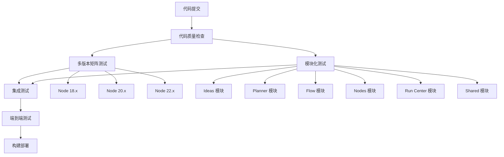

# CI/CD 与团队协作设置完成指南

> 本文档总结了为 Superflow 项目配置的完整 CI/CD 流程和团队协作机制。

## 🎯 设置概览

### 已完成的配置

✅ **多版本 CI/CD 流水线**  
✅ **模块化测试框架**  
✅ **代码所有者权限分配**  
✅ **分支保护规则**  
✅ **团队协作文档**  
✅ **开发者指南**

---

## 🚀 CI/CD 流水线

### 流水线架构



### 流水线阶段详解

#### 1. 代码质量检查 (Quality Gate)

```yaml
# 运行在 Node.js 20.x LTS
- TypeScript 类型检查
- ESLint 代码规范
- Prettier 格式检查
```

#### 2. 多版本矩阵测试 (Compatibility)

```yaml
strategy:
  matrix:
    node-version: [18.x, 20.x, 22.x]

# 为每个版本运行：
- 单元测试
- 覆盖率报告 (仅 20.x)
- 依赖兼容性检查
```

#### 3. 模块化测试 (Module Tests)

```yaml
strategy:
  matrix:
    module: [ideas, planner, flow, nodes, run-center, shared]

# 为每个模块运行：
- 模块独立测试
- 模块覆盖率检查
- 模块边界验证
```

#### 4. 集成测试 (Integration)

```yaml
# 跨模块集成验证：
- 想法 → 蓝图 → DAG → 执行流程
- 数据流传递测试
- API 契约测试
- 错误传播测试
```

#### 5. 端到端测试 (E2E)

```yaml
# 完整用户场景：
- 用户工作流测试
- 浏览器兼容性
- 性能基准测试
- 可访问性检查
```

---

## 👥 团队协作架构

### 模块负责制

| 模块           | 负责团队         | 审查权限          | 关键技能         |
| -------------- | ---------------- | ----------------- | ---------------- |
| **Ideas**      | @ideas-team      | `src/ideas/`      | AI集成、需求分析 |
| **Planner**    | @planner-team    | `src/planner/`    | 图算法、优化     |
| **Flow**       | @flow-team       | `src/flow/`       | React、可视化    |
| **Nodes**      | @nodes-team      | `src/nodes/`      | Worker、沙箱     |
| **Run Center** | @run-center-team | `src/run-center/` | 监控、可观测性   |
| **Shared**     | @shared-team     | `src/shared/`     | 基础设施、类型   |

### 权限分配策略

#### CODEOWNERS 配置

```bash
# 全局架构决策
* @tech-lead @senior-architect

# 模块级权限
/src/ideas/ @ideas-team @product-manager
/src/planner/ @planner-team @algorithm-engineer
/src/flow/ @flow-team @frontend-engineer @ux-designer
/src/nodes/ @nodes-team @backend-engineer
/src/run-center/ @run-center-team @devops-engineer
/src/shared/ @shared-team @tech-lead

# 测试和文档
/src/**/*.test.ts @qa-team
/docs/ @documentation-team @tech-writer
```

#### 分支保护规则

```yaml
main 分支保护:
  required_reviews: 2
  require_code_owner_reviews: true
  required_status_checks:
    - 'Code Quality'
    - 'Test (Node 18.x/20.x/22.x)'
    - 'Module Tests'
    - 'Integration Tests'
  enforce_admins: true
  allow_force_pushes: false
```

---

## 📊 测试策略

### 测试金字塔实施

```
           E2E (5%)
        /            \
   Integration (15%)
  /                  \
Unit Tests (80%)
```

#### 测试分层详解

**单元测试 (80%)**：

```bash
# 覆盖范围
- 纯函数逻辑
- 组件行为
- 错误处理
- 边界条件

# 运行命令
npm run test                    # 所有单元测试
npm run test -- src/ideas      # 特定模块测试
npm run test:coverage          # 覆盖率报告
```

**集成测试 (15%)**：

```bash
# 覆盖范围
- 模块间交互
- API 契约
- 数据流验证
- 状态管理

# 运行命令
npm run test:integration       # 集成测试套件
```

**端到端测试 (5%)**：

```bash
# 覆盖范围
- 完整用户旅程
- 浏览器兼容性
- 性能基准
- 可访问性

# 运行命令
npm run test:e2e              # E2E测试套件
```

### 测试环境配置

#### 测试配置文件

```
vitest.config.ts          # 单元测试配置
vitest.integration.config.ts  # 集成测试配置
vitest.e2e.config.ts       # E2E测试配置
```

#### Mock 策略

```typescript
// 模块级 Mock
vi.mock('reactflow');
vi.mock('@data');

// 环境变量 Mock
process.env.NODE_ENV = 'test';

// Worker Mock
global.Worker = vi.fn();
```

---

## 🔄 开发工作流

### 标准开发流程

```bash
# 1. 创建功能分支
git checkout -b codex/feature-name

# 2. 开发和测试
npm run dev                    # 启动开发服务器
npm run test:watch            # 监视测试
npm run type-check            # 类型检查

# 3. 提交前检查
npm run lint                  # 代码规范
npm run format               # 代码格式
npm run test                 # 全量测试
npm run build               # 构建验证

# 4. 创建 PR
gh pr create --title "feat(module): description" \
  --assignee @teammate \
  --reviewer @module-lead
```

### 自动合并机制

#### 触发条件

1. PR 标题包含 `[auto-merge]`
2. 或添加 `auto-merge` 标签

#### 前置条件

```yaml
# 必须满足所有条件：
- 所有 CI 检查通过 ✅
- 获得必需的审查批准 ✅
- 代码所有者已审查 ✅
- 分支是最新的 ✅
- 无合并冲突 ✅
```

---

## 📈 质量指标

### 代码质量目标

| 指标       | 目标值 | 当前值 | 监控工具       |
| ---------- | ------ | ------ | -------------- |
| 测试覆盖率 | ≥80%   | -      | Codecov        |
| 类型覆盖率 | 100%   | -      | TypeScript     |
| 代码重复率 | ≤5%    | -      | SonarQube      |
| 圈复杂度   | ≤10    | -      | ESLint         |
| 构建时间   | ≤5分钟 | -      | GitHub Actions |

### 团队效率指标

| 指标             | 目标值  | 监控方式          |
| ---------------- | ------- | ----------------- |
| PR 合并时间      | ≤2天    | GitHub Insights   |
| CI 成功率        | ≥95%    | Actions Dashboard |
| 代码审查响应时间 | ≤24小时 | PR Analytics      |
| 缺陷逃逸率       | ≤5%     | 生产监控          |

---

## 🛠️ 工具链配置

### 开发环境

```json
{
  "推荐 VS Code 扩展": [
    "ms-vscode.vscode-typescript-next",
    "esbenp.prettier-vscode",
    "ms-vscode.vscode-eslint",
    "vitest.explorer",
    "bradlc.vscode-tailwindcss"
  ]
}
```

### CI/CD 工具

```yaml
GitHub Actions:
  - 代码质量检查
  - 多版本兼容性测试
  - 模块化测试执行
  - 自动合并处理
  - 构建产物生成

外部集成:
  - Codecov: 覆盖率报告
  - SonarQube: 代码质量分析
  - Dependabot: 依赖更新
```

---

## 🚀 部署上线

### 部署前检查清单

**代码质量**：

- [ ] 所有 CI 检查通过
- [ ] 代码审查完成
- [ ] 测试覆盖率达标
- [ ] 无高优先级技术债务

**功能验证**：

- [ ] 功能测试通过
- [ ] 性能测试通过
- [ ] 安全扫描通过
- [ ] 可访问性检查通过

**文档更新**：

- [ ] API 文档更新
- [ ] 用户文档更新
- [ ] 运维文档更新
- [ ] 变更日志生成

### 发布流程

```bash
# 1. 创建发布分支
git checkout -b release/v1.2.3

# 2. 版本更新
npm version 1.2.3

# 3. 最终测试
npm run test:all
npm run build:production

# 4. 合并发布
gh pr create --title "release: v1.2.3" \
  --base main \
  --label "release"

# 5. 发布后标记
git tag v1.2.3
git push origin v1.2.3
```

---

## 📞 支持与联系

### 关键联系人

| 角色         | 负责人         | 联系方式              |
| ------------ | -------------- | --------------------- |
| 技术负责人   | @tech-lead     | tech-lead@company.com |
| CI/CD 管理员 | @devops-team   | devops@company.com    |
| 质量负责人   | @qa-lead       | qa@company.com        |
| 安全负责人   | @security-team | security@company.com  |

### 问题反馈

- **CI 问题**：[GitHub Issues](https://github.com/org/superflow/issues/new?template=ci-issue.md)
- **协作问题**：[团队讨论](https://github.com/org/superflow/discussions)
- **紧急问题**：Slack #urgent-help

### 相关文档

- [开发指南](./DEVELOPMENT_GUIDE.md)
- [团队协作指南](./TEAM_COLLABORATION.md)
- [分支保护规则](../.github/branch-protection.md)
- [自动合并指南](../.github/AUTO_MERGE_GUIDE.md)

---

## ✅ 下一步行动

### 立即执行

1. **安装依赖**：`npm install`
2. **配置团队**：根据 CODEOWNERS 分配权限
3. **设置分支保护**：应用 GitHub 分支保护规则
4. **运行测试**：验证所有测试套件正常工作

### 后续优化

1. **性能监控**：集成性能监控工具
2. **安全扫描**：添加自动化安全扫描
3. **依赖管理**：配置 Dependabot 自动更新
4. **文档自动化**：API 文档自动生成

---

_设置完成日期：2024年8月_  
_下次审查：2024年9月（月度回顾）_
