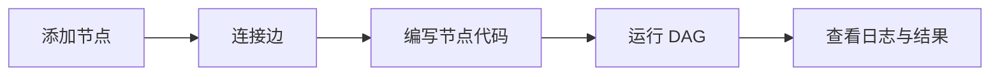

# 🛠️ Studio 页面使用指南

Studio 页面用于在浏览器内编排并调试工作流，是后续运行中心与 Inspector 等能力的统一入口。

## 主要交互

- **节点操作**：在画布上拖拽或点击添加节点，通过连线建立依赖。
- **参数编辑**：双击节点打开右侧 Inspector，填写输入、资源与运行配置。
- **运行与调试**：点击顶部工具栏的运行按钮可触发 DAG 执行，运行状态与日志实时显示在下方 Console。
- **版本对比**：切换「Diff」页签可查看当前代码与历史版本差异。

## 使用步骤

1. 打开 Studio 页面，默认加载示例 DAG。
2. 拖拽节点或使用快捷键新增节点，并拖动端点建立连接。
3. 双击节点，在 Inspector 中编写或修改代码与参数。
4. 点击运行按钮，观察 Console 中的实时日志。
5. 若运行失败，可在 Inspector 内修复后重新运行直至成功。

## 当前限制

- 仅提供前端模拟执行，刷新页面会丢失运行状态与临时数据。
- 暂不支持多人协作、权限控制与持久化存储。
- DAG 规模较大时性能可能下降，自动布局与虚拟化尚在优化中。

## 替换背景

早期我们在仓库中提供了[《工作流编排 Studio（模拟页面）》](./工作流编排_studio（模拟页面）.jsx)作为交互样板，功能与真实运行环境脱节。现在该示例已由实际的 Studio 页面（位于 `src/studio/`）替换，逐步对接 Run Center、Inspector 等模块，实现可运行的编排体验。

## 后续计划

- 打通 Console 与全局状态管理，支持命令面板与全局搜索。
- 引入画布虚拟化与自动布局，以支持百级以上节点的顺滑操作。
- 增强可观察性：日志联动、Trace 追踪、运行进度条可点击跳转。
- 支持插件化节点与版本管理，提升可扩展性与协作效率。

